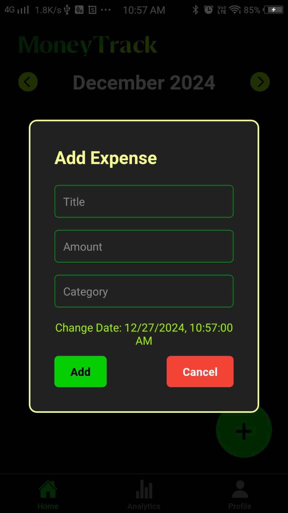

# MoneyTrack

MoneyTrack is a responsive React Native app designed for effective personal finance management. The app helps users track expenses, view analytics, and manage their profiles seamlessly.

## Features

- **First-Time User Splash Screen**: Welcomes new users with a "Get Started" button.
- **Daily Splash Screen**: Brief display for returning users.
- **Home Section**: View and manage daily expenses.
- **Analytics Section**: Visualize spending patterns.
- **Profile Section**: Manage user details.
- **Expense Categories**: Categorize expenses for better insights.

---

## Screenshots

### 1. First-Time User Splash Screen
<table>
  <tr>
    <td></td>
    <td></td>
  </tr>
  <tr>
    <td></td>
    <td></td>
  </tr>
</table>

### 2. Daily Splash Screen


### 3. Home Screen


### 4. Analytics Screen


### 5. Profile Screen


### 6. User Details Input


### 6. Expense Adding Screen


---

## Installation

Follow these steps to run the app locally:

1. Clone the repository:
   ```bash
   git clone https://github.com/your-username/moneytrack.git
   cd moneytrack
   ```

2. Install dependencies:
   ```bash
   npm install
   ```

3. Start the app:
   ```bash
   npm start
   ```

4. Launch the app on an emulator or a physical device.

---

## Tech Stack

- **Frontend**: React Native (Expo)
- **Storage**: AsyncStorage (local storage)
- **Design**: Custom UI with Figma inspiration


## Contributing

Contributions are welcome! Please follow these steps:

1. Fork the repository.
2. Create a new branch:
   ```bash
   git checkout -b feature-name
   ```
3. Commit your changes:
   ```bash
   git commit -m "Add feature"
   ```
4. Push to the branch:
   ```bash
   git push origin feature-name
   ```
5. Open a pull request.

---

## Contact

For any queries, reach out at ayush.ranjan0503@gmail.com .

---

